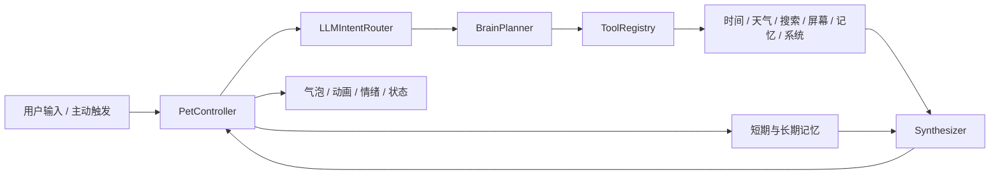

# Maidie Desktop Pet 技术说明与能力现状

> 文档基线：2026-07-02。本文描述当前代码已经实现并经过测试的能力，同时明确尚未完成的边界。

## 1. 项目定位

Maidie 是一个运行在 Windows 桌面的常驻 AI 桌宠。它把透明置顶的 PyQt6 桌面角色、WebP 动画图集、流式大模型对话、本地记忆、联网搜索、桌面感知和受控系统工具整合到同一个应用中。

项目的核心目标不是单纯提供聊天窗口，而是让角色具备三个层次的能力：

1. **桌面角色层**：移动、缩放、动画、鼠标互动、跟随式输入框和消息气泡。
2. **AI Agent 层**：识别聊天、事实任务、屏幕问题、代码问题和系统操作，再选择相应工具。
3. **安全执行层**：工具只返回结构化数据；系统写操作需要用户确认；敏感信息不进入长期记忆。

## 2. 技术栈

| 领域 | 当前实现 |
|---|---|
| 语言与运行时 | Python 3.10+ |
| 桌面界面 | PyQt6 |
| 角色动画 | hatch-pet 8×9 WebP 图集、自定义动作条 |
| AI 接口 | DeepSeek / OpenAI Chat Completions 兼容接口、SSE 流式输出 |
| 联网搜索 | Tavily Search API |
| 本地存储 | SQLite |
| 屏幕识别 | pytesseract，可选启用 |
| 图像处理 | Pillow |
| 测试 | Python `unittest`、Qt offscreen 集成测试 |

## 3. 总体架构

`main.py` assembles the production AI path from `core/brain/*`. The older
`ai/router.py` and AI orchestration modules in `core/agent/*` are retained only
for compatibility and legacy tests; new AI features must target `core.brain`.
`core/agent/confirmation.py` remains active production security infrastructure.



生产聊天入口统一经过 `BrainRouter`。正常情况下，`LLMIntentRouter` 将输入分类为：

- `chat`：日常交流和情绪陪伴。
- `task`：需要时间、天气、搜索或记忆数据的任务。
- `screen`：询问当前屏幕、窗口或应用状态。
- `code_task`：代码、构建、调试和技术文档问题。
- `system_task`：文件读取、文件搜索、截图或需要确认的系统操作。

LLM 路由失败、超时或返回非法 JSON 时，系统使用正则分类器降级。Planner 只生成结构化计划，不直接回答；工具只提供事实；最终用户可见内容只由 Synthesizer 生成。

## 4. 桌面角色与交互能力

### 4.1 窗口与渲染

- 无边框、透明背景、始终置顶的工具窗口。
- 默认尺寸可配置，支持边缘拖拽、滚轮和右下角控制点缩放。
- 角色始终从原始 `192×208` 动画帧重新渲染，并使用高 DPI 画布，避免反复缩放造成累计模糊。
- 输入框和消息气泡是独立跟随浮窗，会根据屏幕边缘自动选择角色上、下、左、右位置。
- 气泡采用外层绘制容器和内层文本视图，背景保持高不透明度并支持平滑尺寸动画。
- 浮窗定位具备重入保护，防止 `resizeEvent → 重新定位 → adjustSize` 形成递归崩溃。

### 4.2 动画和状态

主图集支持 `idle`、`walk`、`run`、`thinking`、`talking`、`waiting`、`review`、`failed`、`happy`、`reacting` 和 `sleeping` 等状态。动作切换包含约 160ms 的交叉过渡。

外部动作由 `assets/actions/actions.json` 数据驱动，当前包含摸头、戳脸、害羞、庆祝、瞌睡和向右拖动眩晕等动作。每项动作可以独立设置帧率、持续时间、冷却、优先级、状态和触发词。

中央状态机是唯一状态来源。用户互动优先于光标互动，光标互动优先于 AI 响应，AI 响应优先于自主移动和待机行为。

### 4.3 输入方式

- 双击角色，或按 Enter / 空格，打开聊天输入框。
- Esc、失焦、发送完成或 10 秒无输入后关闭输入框。
- 点击头部触发摸头；点击脸部触发戳脸；点击身体触发 AI 回复。
- 头部左右往返拖动识别为连续抚摸，其他明显移动仍作为窗口拖动。
- 角色可自动游走、避开屏幕边缘，并根据速度切换走路与跑步动画。

## 5. AI 对话与路由能力

### 5.1 流式对话

AI 客户端支持 OpenAI 兼容的 `/chat/completions` 接口和 SSE 流。输出在内部规范化为：

```json
{
  "text": "回复正文",
  "emotion": "idle|happy|thinking|shy",
  "action": "talk|react|think",
  "state": "talking|idle|thinking",
  "source": "chat|tool|screen|code_task|system_task"
}
```

流式文本先进入句子分割和节奏控制层，再逐段显示到气泡中。网络路由和模型请求全部在工作线程执行；Qt 主线程通过定时轮询安全接收完成结果，因此按回车不会被意图分类网络请求阻塞，也避免后台完成回调直接访问 Qt 对象。

### 5.2 技术问题

- 代码、编译、调试、API 和构建系统问题会进入技术路由。
- “是什么”“什么意思”“有哪些”“怎么用”“官方文档”等知识查询会选择联网搜索，并在查询中优先要求官方文档。
- 例如 `CMakeLists 有哪些函数` 和 `add_library() 是什么意思` 已能调用 Tavily、获取资料，再由技术模型组织成 Maidie 的回答。
- 纯粹的兴趣表达，例如“我最近对 CMake 很感兴趣”，按闲聊处理，不会误触发工具。

## 6. 工具系统

| 工具 | 数据来源 | 当前能力 |
|---|---|---|
| `time` | 本机时间 | 返回当前日期、时间及时区事实 |
| `weather` | 天气服务 | 返回城市、温度和天气摘要 |
| `search` | Tavily | 返回摘要、标题、URL 和最多 5 个来源 |
| `screen` | OCR、应用和窗口跟踪 | 返回屏幕文字、当前应用、窗口与活动类型 |
| `memory` | SQLite | 读取近期聊天、事实和偏好 |
| `system` | 本机受控执行器 | 文件读取、文件搜索、截图及受确认保护的操作 |

所有工具返回 `type/raw/source` 结构。天气、时间、屏幕和联网事实缺失时，Synthesizer 被要求明确说明暂时无法取得结果，不允许自行猜测。

## 7. 联网搜索

联网功能默认关闭，用户可在设置界面启用并配置 Tavily API Key。当前链路为：

```text
技术/事实查询 → Planner(search) → SearchTool → NetworkPlugin
→ SearchService → Tavily API → 结构化摘要与来源 → Synthesizer
```

网络错误、超时、未配置 Key、服务商不支持或空结果都会转成结构化错误，不应导致进程退出。当前仅实现 Tavily 适配器，其他搜索服务需要新增 provider adapter。

## 8. 记忆系统

`memory/memories.db` 使用 SQLite 保存：

- 最近 20 条 `chat` 对话。
- 长期 `fact` 事实。
- 长期 `preference` 偏好。

每轮对话完成后，系统可在后台提取事实和偏好。API Key、密码、令牌、证件、银行卡、联系方式、地址和健康隐私等内容会被敏感信息规则过滤。数据库及其 WAL/SHM 文件被 Git 忽略，不会随代码提交。

## 9. 桌面感知与主动行为

- 鼠标、空闲时间、前台窗口、应用类型和可选 OCR 组成桌面上下文。
- 剪贴板追踪只检测变化，不读取正文。
- OCR 默认关闭；开启后在本机通过 Tesseract 识别。
- 主动行为默认关闭，支持空闲、长时间编程、场景变化和窗口频繁切换等触发条件。
- 主动提示具有全局冷却，避免频繁打扰。
- `once`、`cron` 和 `condition` 任务保存于本地 JSON。

## 10. 权限与安全边界

- 文件读取、文件搜索和不覆盖已有文件的截图属于只读能力。
- 创建文件、打开应用或文件夹、切换窗口、写入剪贴板等操作必须经过 PyQt 确认框。
- 确认框默认选择“否”，超时按拒绝处理。
- 删除文件、执行任意脚本和任意系统命令当前始终禁止。
- 配置界面对 API Key 使用密码显示，并在公共配置快照中只暴露“是否已配置”。
- 配置文件中的 Key 仍是本地明文，推荐优先使用环境变量保存主 AI Key。

## 11. 当前质量状态

截至本文档基线，完整测试集包含 **80 项通过测试**，覆盖：

- 状态优先级、移动边界和方向保持。
- 动作注册、冷却、摸头和拖动手势。
- 流式分句、气泡增量显示、尺寸动画和背景可读性。
- 回车发送不在 Qt 主线程执行网络路由。
- LLM-first 意图分类、正则降级、Planner 与工具数据边界。
- CMake 技术知识查询进入联网搜索。
- 屏幕感知、时间、天气、记忆和网络错误降级。
- 配置保存、API Key 隐藏及主动行为默认关闭。

实际环境还完成了 Tavily 健康检查，以及 CMake 查询从意图分类、联网检索到最终回答的端到端验证。

## 12. 已知限制

- 目前只有 Tavily 搜索 provider。
- OCR 的识别质量依赖 Tesseract 安装、语言包、屏幕缩放和画面清晰度。
- `codex` 与 `opencode` 目前是 Planner 允许的计划名称，但尚未作为独立工具注册；知识型技术问题已经通过搜索链路规避这一缺口，完整的外部编码执行器仍需后续实现。
- 系统工具刻意限制写入和执行能力，不是通用桌面自动化框架。
- 没有语音输入、TTS、Live2D、Spine 或云端多设备记忆同步。
- 网络搜索来源已进入结构化工具数据，但是否在短气泡中完整展示 URL 仍取决于最终回答长度与后续 UI 设计。

## 13. 运行、测试与扩展入口

启动：

```powershell
python main.py
```

运行完整测试：

```powershell
python -m unittest discover -v
```

主要扩展点：

- 新模型：实现 `AIClient` 或使用 OpenAI 兼容接口。
- 新工具：继承 `core.tools.base.Tool` 并注册到 `ToolRegistry`。
- 新搜索服务：为 `SearchService` 增加 provider adapter。
- 新动画：实现 `AnimationBackend` 或导入新的 WebP 动作条。
- 新感知源：扩展 `AwarenessContext`，并保持隐私默认关闭原则。
- 新系统操作：加入 `SystemTool` 的允许列表，并明确确认和拒绝策略。

## 14. 近期改进摘要

本次版本集中解决了三个实际问题：

1. **发送卡顿**：移除 Qt 主线程中的重复 LLM 意图分类，将完整路由放到工作线程。
2. **Qt 稳定性**：工作线程完成结果改由主线程轮询接收；浮窗定位增加重入保护，避免递归崩溃。
3. **技术搜索失效**：技术知识问题不再计划一个未注册的 `codex` 工具，而是使用真实联网搜索并优先检索官方文档。
